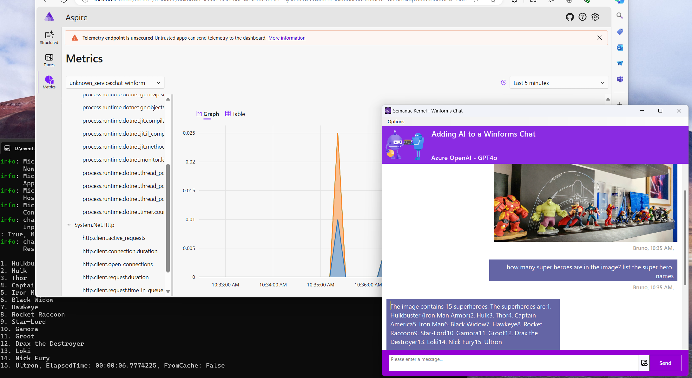

# Adding AI to Your Existing .NET Apps - Workshop

[](/LICENSE)
[](https://twitter.com/elbruno)


Welcome to the Adding AI to Your Existing .NET Apps Workshop. This repository contains a set of .NET projects to demostrate how to add AI to a common .NET scenario: **Winform as front end app, and an WebAPI as backend**.

The following image shows the WinForm Chat App interacting with an GPT-4o model in Azure OpenAI, and metrics traced using Aspire Dashboard.



These are the different steps included in the workshop:

1. Standard Winform + API NET Chat App
2. Add Azure OpenAI GPT-4o to support chat (text)
3. Add Azure OpenAI GPT-4o to support chat + image (text)
4. Add Phi-3 to support chat using ONNX (text)
5. Add Phi-3 to support chat + image using ONNX (text)
6. Add Phi-3 to support chat using Ollama in docker(text)
7. Add Cache using Semantic Memory, local in Memory
8. Add Cache using Semantic Memory, store in Azure AI Search
9. Add RAG using Azure AI Search
10. Add Aspire Dashboard using OTLP endpoint
11. Use an external API using native functions

## Prerequisites

Before running the sample, ensure you have the following installed:

- **[.NET 8](https://dotnet.microsoft.com/en-us/download)**: Make sure you have the latest version of .NET installed on your machine.

- **[Visual Studio or Visual Studio Code](https://visualstudio.microsoft.com/downloads/)**: You will need an IDE or code editor capable of running .NET projects. Visual Studio or Visual Studio Code are recommended.

- **[Azure OpenAI Services](https://learn.microsoft.com/azure/ai-services/openai/overview)**: To GPT-4o as the model to support the chat, you need to have access to Azure OpenAI Services and create and deploy a GPT-4o model.

- **[Ollama](https://ollama.com/download)**: To use Phi-3 as local model with Ollama, you need to have ollama installed.

- **[Docker Desktop](https://www.docker.com/products/docker-desktop/)**: To use Phi-3 as local model with Ollama, you need to have docker installed.

  - **[Ollama in Docker](https://ollama.com/blog/ollama-is-now-available-as-an-official-docker-image)**. Follow the link steps to install ollama in Docker.

  - **[Aspire Dashboard in Docker](https://www.aspiredashboard.com/)**. Follow the link steps to install the Aspire Dashboard in Docker.

- **[Super Hero API](https://superheroapi.com)**: To use the native functions demo, get a free key for the SuperHero API.

### Project Secrets

The `chat-server` project uses .NET User Secrets to access remote resources like Azure OpenAI Services or Azure AI Search. 

Follow these steps to add the secrets to the project.

1. Open a terminal and navigate to the `chat-server` project. 

    ```bash
    cd .\src\chat-server\
    ```

1. Run the following command with the correct values

    ```bash
    dotnet user-secrets init
    dotnet user-secrets set "AZURE_OPENAI_MODEL" "< Azure OpenAI Model, ie: gpt-4o >"
    dotnet user-secrets set "AZURE_OPENAI_ENDPOINT" "< Azure OpenAI Endpoint >"
    dotnet user-secrets set "AZURE_OPENAI_APIKEY" "< Azure OpenAI Key >"
    dotnet user-secrets set "AZURE_OPENAI_ADA02" "< Azure OpenAI Embeddings model, ie: text-embedding-ada-002 >"
    dotnet user-secrets set "AZURE_AISEARCH_ENDPOINT" "< Azure AI Search Endpoint >"
    dotnet user-secrets set "AZURE_AISEARCH_APIKEY" "< Azure AI Search ApiKey >"
    dotnet user-secrets set "AZURE_AISEARCH_INDEXNAME" "< Azure AI Search IndexName for RAG >"
    dotnet user-secrets set "OTLP_ENDPOINT" "< OTLP ENDPOINT, ie: http://localhost:4317 >"
    dotnet user-secrets set "SUPERHERO_APIKEY" "< super hero api key >"
    ```

### Install Phi-3 locally, to be used in the ONNX scenarios

- Create a local folder to store the Phi-3 local model. In example: `C:\phi3\models`.

- Download the **phi3-mini-4k-instruct-onnx** model to your local machine:
    ```bash
    # navigate to the folder to store the models
    cd c:\phi3\models

    # add support for lfs
    git lfs install 

    # clone and download mini 4K instruct model
    git clone https://huggingface.co/microsoft/Phi-3-mini-4k-instruct-onnx

    # clone and download vision 128K model
    git clone https://huggingface.co/microsoft/Phi-3-vision-128k-instruct-onnx-cpu
    ```
    ***Important:** The current demos are designed to use the ONNX versions of the model. The previous steps clone the following models.*

## Live Demo Recording

Coming soon ...

## Resources

- [Phi-3 Microsoft Blog](https://aka.ms/phi3blog-april)
- [Phi-3 Technical Report](https://aka.ms/phi3-tech-report)
- [Phi-3 Cookbook](https://aka.ms/Phi-3CookBook)
- [Using Phi-3 & C# with ONNX for text and vision samples](https://devblogs.microsoft.com/dotnet/using-phi3-csharp-with-onnx-for-text-and-vision-samples-md/)
- [Generative AI for beginners](https://github.com/microsoft/generative-ai-for-beginners)
- [Semantic Kernel main repository](https://github.com/microsoft/semantic-kernel)
- [Smart Components - Local Embeddings](https://github.com/dotnet-smartcomponents/smartcomponents/blob/main/docs/local-embeddings.md)
- [Aspire Dashboard](https://www.aspiredashboard.com/)
- [Snippet Generator](https://snippet-generator.app/?description=&tabtrigger=&snippet=&mode=vscode)
- [WinForm Chat - inspirational project](https://github.com/agreentejada/winforms-chat)

## Author

👤 **Bruno Capuano**

* Website: https://elbruno.com
* Twitter: [@elbruno](https://twitter.com/elbruno)
* Github: [@elbruno](https://github.com/elbruno)
* LinkedIn: [@elbruno](https://linkedin.com/in/elbruno)

## 🤝 Contributing

Contributions, issues and feature requests are welcome!

Feel free to check [issues page](./issues).

## Show your support

Give a ⭐️ if this project helped you!


## 📝 License

Copyright &copy; 2024 [Bruno Capuano](https://github.com/elbruno).

This project is [MIT](/LICENSE) licensed.

***
